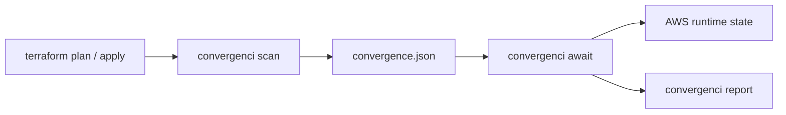

# Convergenci

[](https://codecov.io/gh/iilei/convergenci-cli)

Convergenci is a small AWS-bound CLI that verifies that an infrastructure change has converged to the intended runtime state.

The tool does not perform infrastructure changes itself. Terraform remains responsible for applying changes. Convergenci observes AWS after the change and determines whether the expected postcondition has been reached.

## Design principle

> Plan intent first, observe runtime state afterward, and determine convergence from explicit postconditions.

Terraform answers: what should change?
AWS answers: what actually happened?
Convergenci answers: has the intended runtime state converged?



## Scope

The initial implementation is intentionally AWS-specific and focuses on:

- EC2 Auto Scaling Groups (ASG)

It does not currently include:

- EKS
- generic cloud-provider abstractions
- Terraform apply orchestration
- AWS SDK integration
- arbitrary shell execution

## Workflow

```bash
terraform plan -out=tfplan
terraform show -json tfplan > tfplan.json

convergenci scan tfplan.json > convergence.json

convergenci scan --assert-all-settled tfplan.json

terraform apply tfplan

convergenci await convergence.json
```

## Billable AWS tests

The repository includes opt-in end-to-end tests that create a small Auto Scaling
Group in `eu-central-1`, exercise the Terraform plan, convergence scan,
`assert-all-settled`, await, and report flow, and destroy the resources on exit.
They are separate from the local fake-AWS benches because they create billable
AWS resources.

### Authentication and prerequisites

Install the repository-managed tools first:

```bash
mise install
```

The live tests also require the AWS CLI. Use
an isolated AWS account or sandbox role with permission to manage the test
resources. The test uses the normal AWS credential chain; it does not read
credentials from repository files.

For AWS SSO, configure a profile interactively and log in before running the
test:

```bash
aws configure sso --profile convergenci-sandbox
aws sso login --profile convergenci-sandbox
export AWS_PROFILE=convergenci-sandbox
```

For an assumed role or CI identity, configure the standard AWS environment
variables or web-identity credential variables instead. Do not commit access
keys, session tokens, or backend credentials.

The test is fixed to `eu-central-1` and requires an explicit opt-in:

```bash
export ALLOW_BILLABLE_TEST=true
mise run billable-terraform-test
```

The live instance-refresh warmup defaults to one second for a quick test. Set
`CONVERGENCI_LIVE_INSTANCE_WARMUP_SECONDS` to a larger non-negative integer to
make polling and refresh progress easier to observe:

```bash
CONVERGENCI_LIVE_INSTANCE_WARMUP_SECONDS=30 \
  mise run billable-terraform-test
```

To verify timeout handling, use the dedicated scenario. It intentionally sets
the await timeout below the instance warmup and succeeds only when timeout is
reported as expected:

```bash
mise run billable-terraform-test-timeout
```

Run the Terragrunt variant with:

```bash
export ALLOW_BILLABLE_TEST=true
export AWS_PROFILE=convergenci-sandbox
mise run billable-terragrunt-test
```

The test uses the default VPC and one small `t3.micro` instance. It does not
create a NAT gateway, load balancer, database, or other supporting service.
Every resource receives a unique `convergenci-test-id` tag. Cleanup is installed
as an exit trap and runs Terraform or Terragrunt destroy even when the test
fails or is interrupted. A failed process should still be checked manually in
the AWS console before the sandbox is reused.

`scan` is the stateless plan-to-contract step: it resolves the relevant AWS
resources from the Terraform plan and emits a convergence contract.

`scan --assert-all-settled` uses the same plan-based resource resolution as plain
`scan` and adds one preflight guard: it exits non-zero if any relevant resource
is already in progress. It behaves like the plain scan path for resource
selection and any scan-phase side effects, and it only adds the extra fail-fast
check before returning.

`scan --assert-all-settled` assumes the caller holds a Terraform state lock for
the duration of `apply`, so at most one relevant change can be in flight.
Under that assumption, correlation between an apply and its runtime effect no
longer needs to resolve concurrent/superseding changes (see the ADR for
details) — it only needs a pre-apply/post-apply boundary.

### Refresh correlation edge case

The state lock does not cover the complete shell sequence from `plan` through
`scan`, `apply`, and `await`. Use an external CI/job lock when multiple
deployments could otherwise run concurrently. Always apply the exact saved plan
that was scanned, and invoke `scan --assert-all-settled` immediately before
that apply.

For ASGs, a previous successful instance refresh can still be visible when
`await` starts. A successful observation must therefore be understood as the
refresh produced by the just-applied plan, not merely as any historical
successful refresh. Avoid reusing an old convergence contract or report, keep
the plan, contract, and report together, and treat a preflight failure as a
reason to stop rather than to continue with `await`.

The invariant to verify in integration tests is:

```text
assert-all-settled succeeds
apply the saved plan
await does not accept the previous refresh as this apply's result
await accepts the new refresh only after its expected trigger converges
```

If the workflow cannot guarantee that boundary, do not infer convergence from
an already-successful runtime state; serialize the deployment externally and
rerun the plan/scan/apply sequence.

## CLI

```text
convergenci [flags] [command]
```

### Global flags

- `-v, --version`: show the CLI version and build metadata
- `--debug`: enable debug logging
- `-h, --help`: show help output

### Commands

#### `scan`

Scan a Terraform plan and emit a convergence contract.

```bash
convergenci scan [--output-json PATH] [--jsonlines] [--aws-cli-path PATH] [--aws-profile-name NAME] <tfplan.json>
```

Behavior:

- defaults to a plan-derived output name such as `asg-default-rotation.convergence.json`
- with `--jsonlines` it writes `asg-default-rotation.convergence.jsonlines`
- if no plan input is supplied it falls back to `.convergence.json` or `.convergence.jsonlines`
- AWS CLI invocation can be directed with `--aws-cli-path` and `--aws-profile-name`
- AWS CLI path can also be set with `CONVERGENCI_AWS_CLI_PATH`; an explicit `--aws-cli-path` flag takes precedence
- output paths must be safe: absolute paths are allowed, but relative paths that escape the working directory via `..` are rejected
- existing output files are not overwritten unless `--force` is supplied

Example:

```bash
convergenci scan --output-json ./artifacts/asg-plan.convergence.json tfplan.json
convergenci scan --output-json /tmp/asg-plan.convergence.json --force tfplan.json
```

##### `scan --assert-all-settled`

Assert that nothing relevant is currently converging for the resources that
`scan` would otherwise turn into a contract, across all resource kinds
supported by convergenci (currently only ASG instance refreshes).

```bash
convergenci scan --assert-all-settled [--aws-cli-path PATH] [--aws-profile-name NAME] <tfplan.json>
```

Behavior:

- resolves AWS resource names (e.g. Auto Scaling Group names) from the
  Terraform plan, using the same matching rules `scan` uses to build a
  contract — no convergence contract or explicit resource names are required
- for each matched resource, observes AWS and exits non-zero if a relevant
  runtime operation (an ASG instance refresh) is currently in progress
- differs from plain `scan` only in the terminal outcome: plain `scan` emits a
  contract, while `scan --assert-all-settled` performs a preflight assertion and
  returns a failing exit status when any relevant resource is not settled
- does not write a convergence contract or any other file in this mode; it is
  a point-in-time AWS check

This command assumes the caller holds a Terraform state lock (or otherwise
serializes applies) for the duration of `apply`, so it does not attempt to
resolve concurrent or superseding changes — it only establishes a
before/after boundary for correlation.

#### `await`

Wait for the runtime state described in a convergence contract to converge.

```bash
convergenci await [--timeout 5m] [--interval 5s] [--debug-format '{{ .Status }} {{ .PercentageComplete }}%'] [--aws-cli-path PATH] [--aws-profile-name NAME] <convergence.json>
```

Behavior:

- reads the contract produced by `scan`
- polls AWS until the expected resources converge or fail
- writes a sibling report next to the contract as `<stem>.convergence-report.json`
- defaults to refusing writes to an existing report file, unless `--force` is supplied
- supports timeout and polling interval overrides through environment variables:
  - `CONVERGENCI_AWAIT_TIMEOUT`
  - `CONVERGENCI_AWAIT_INTERVAL`

Example:

```bash
convergenci await --timeout 10m --interval 15s ./artifacts/asg-plan.convergence.json
convergenci await --force ./artifacts/asg-plan.convergence.json
```

#### `report`

Render a convergence report file (produced by `await`) as human-readable text.

```bash
convergenci report <convergence-report.json>
```

Behavior:

- uses the built-in `templates/report-as-text.tmpl` template, embedded into the
  binary at build time, so no external template file or `gomplate` install is
  required
- reads the JSON report given as a positional argument and prints the
  rendered text to stdout

Example:

```bash
convergenci report ./artifacts/asg-plan.convergence-report.json
```

## Debug logging

Debug logging is controlled by the global `DEBUG` environment variable and the `--debug` flag.

When debug logging is enabled, the default format is:

```text
[DEBUG 2026-09-19T12:00:00Z] status=InProgress pct=45
```

Override it with `CONVERGENCI_DEBUG_FORMAT` or the `--debug-format` flag.

```bash
DEBUG=true convergenci --debug scan tfplan.json
```

The CLI uses a single package-scoped logger that is initialized once and then read from subsequent calls without re-passing configuration.

The debug output format can be customized with `CONVERGENCI_DEBUG_FORMAT` using a Go text template. The template receives the runtime object fields plus a few convenience values:

- `.Status`
- `.PercentageComplete`
- `.Prefix`
- `.Level`
- `.Timestamp`

Examples:

```bash
DEBUG=true \
CONVERGENCI_DEBUG_FORMAT='status={{ .Status }} pct={{ .PercentageComplete }}' \
convergenci await .convergence.json
```

```bash
DEBUG=true \
CONVERGENCI_DEBUG_FORMAT='[{{ .Level }} {{ .Timestamp }}] status={{ .Status }} pct={{ .PercentageComplete }}' \
convergenci await .convergence.json
```

This supports the common log prefix style:

```text
[DEBUG 2026-09-19T12:00:00Z] status=InProgress pct=45
```

## Version output

The CLI version output follows:

```text
1.2.3 (commit: abc123, built at: 2026-09-19)
```

## Notes

- The CLI uses the AWS CLI as its observation boundary rather than embedding AWS SDK code.
- The design intentionally keeps the implementation small and AWS-specific until concrete requirements demand more abstraction.
- The manifest produced by `scan` is the contract consumed by `await`.
