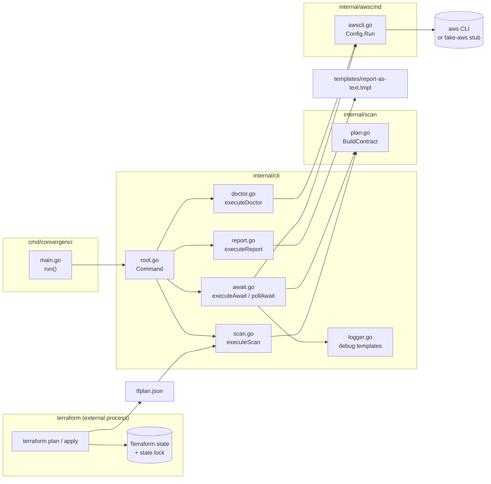
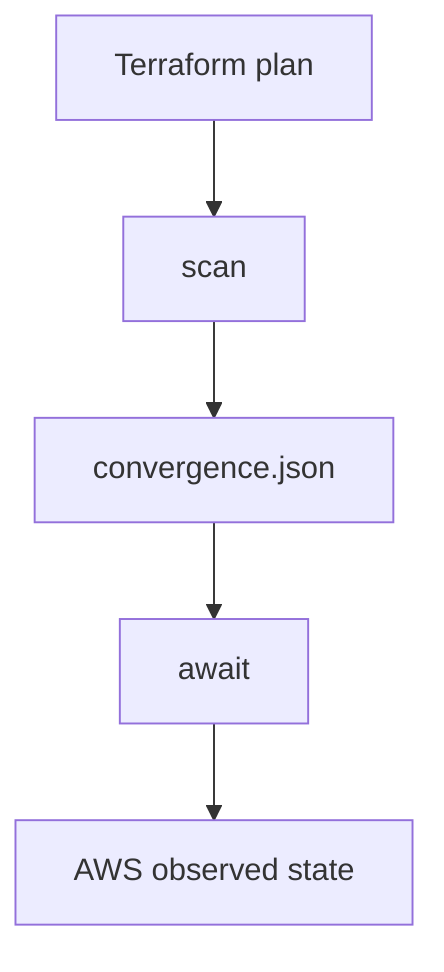
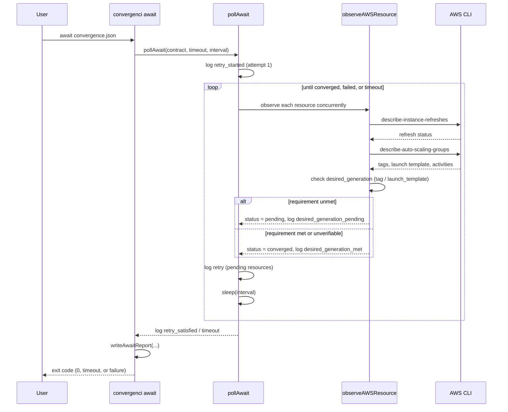
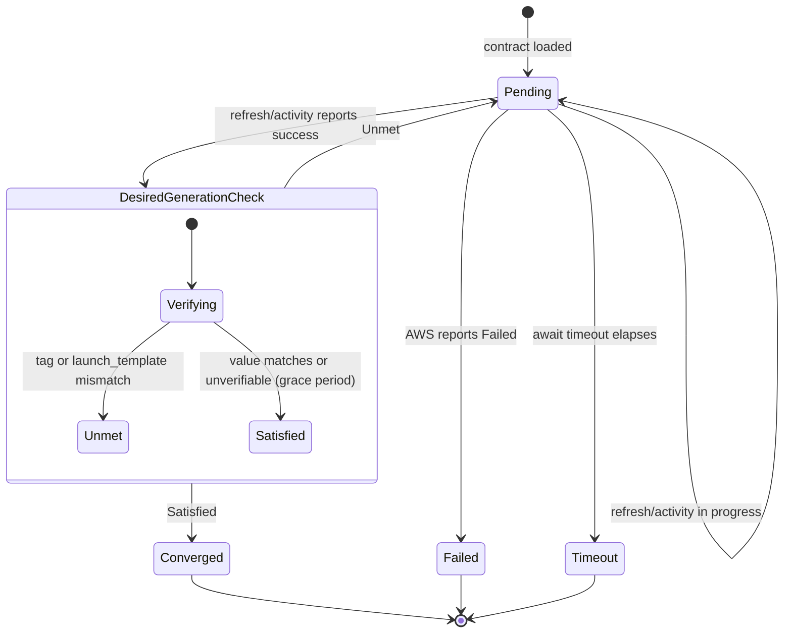
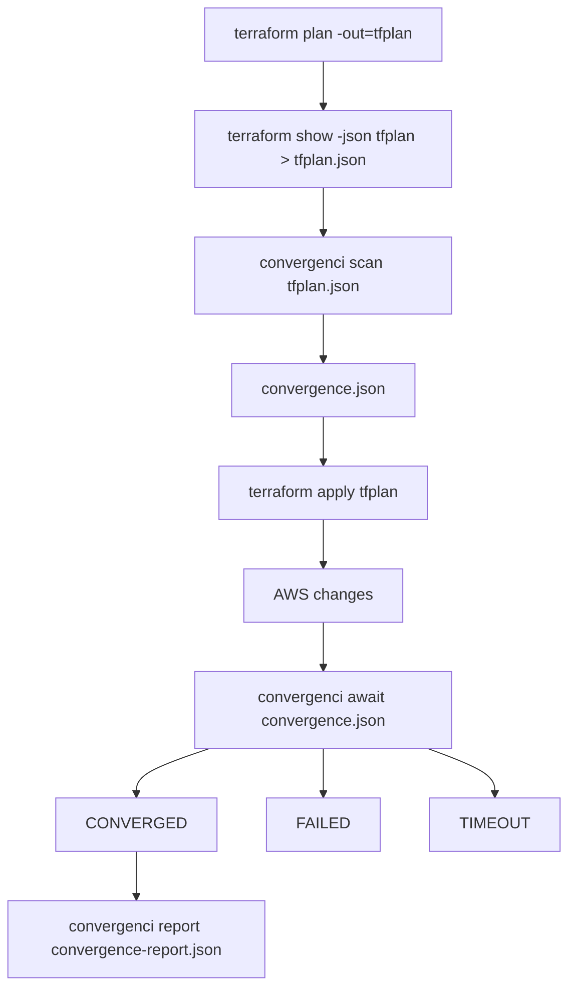

# Convergenci — Design Decisions

## 1. Purpose

Convergenci is a small AWS-bound CLI that verifies that an infrastructure change has converged to the intended runtime state.

The tool does **not** perform infrastructure changes itself. Terraform remains responsible for applying changes. Convergenci observes AWS after the change and determines whether the expected postcondition has been reached.

The core problem is:

> Terraform can declare that infrastructure should change, but it does not by itself provide a reliable way to wait for the externally observable runtime state to converge.

Convergenci closes that gap.

---

## 2. Scope

The initial implementation is intentionally AWS-specific.

### Initial runtime targets

- EC2 Auto Scaling Groups (ASG)
- Amazon ECS

### Explicitly out of scope

- EKS
- Generic cloud-provider abstractions
- Arbitrary infrastructure providers
- Infrastructure mutation
- Terraform apply orchestration
- A plugin system
- A general-purpose DSL
- Starlark or embedded scripting
- An AWS SDK dependency

The design should remain small until there is concrete evidence that additional abstraction is necessary.

---

## 3. CLI

The initial CLI consists of two subcommands:

```text
convergenci scan <tfplan.json>
convergenci await <convergence.json>
```

### `scan`

`scan` reads a Terraform JSON plan and produces a convergence contract.

```bash
convergenci scan tfplan.json > convergence.json
```

It may also support an explicit output path:

```bash
convergenci scan tfplan.json --output convergence.json
```

`scan` does not wait for anything.

Its responsibility is to translate Terraform intent into an explicit, immutable description of what Convergenci expects to observe after the apply.

### `await`

`await` consumes the convergence contract and waits until the corresponding AWS runtime state has converged.

```bash
convergenci await convergence.json
```

`await` performs AWS observations through the AWS CLI.

It returns a non-zero exit code when convergence cannot be established, for example because the expected runtime operation failed or timed out.

### Component overview



`scan` and `await` share the `internal/scan` contract model but never call AWS directly from
`internal/cli`; all AWS CLI invocations go through the single `internal/awscmd.Config.Run` seam,
which is what the fake AWS CLI test binary substitutes.

Terraform state (and the state lock guarding it) is accessed only by the external `terraform`
process. Convergenci never opens, reads, or locks Terraform state directly; it only consumes the
`tfplan.json` that `terraform show -json` derives from it. This is why the lock/correlation boundary
in Section 4 and the `--assert-all-settled` precondition in Section 14 are expressed as assumptions
the caller must uphold, not as something Convergenci enforces itself.

---

## 4. Terraform Is an Input, Not the Runtime

The expected workflow is:

```bash
terraform plan -out=tfplan
terraform show -json tfplan > tfplan.json

convergenci scan tfplan.json > convergence.json

terraform apply tfplan

convergenci await convergence.json
```

Terraform itself remains responsible for applying the change.

Convergenci does not call `terraform apply`.

This separation keeps responsibilities clear:

- Terraform: declare and apply infrastructure changes
- Convergenci: observe AWS and wait for runtime convergence

### Lock and correlation boundary

Terraform's state lock protects individual Terraform operations. It does not
remain held across the complete sequence:

```text
plan -> show -> assert-all-settled -> scan -> apply -> await
```

The caller therefore needs an external CI/job lock when more than one
deployment could operate on the same state. The apply must use the exact saved
plan that was scanned, and the preflight assertion should run immediately
before that apply.

For ASGs, an earlier successful instance refresh may still be observable when
`await` starts. The integration invariant is that `await` must not mistake
that previous success for the refresh created by the current apply. The
minimal test scenario is:

1. Establish a previous successful refresh.
2. Run `scan --assert-all-settled` and require success.
3. Apply the saved plan.
4. Require `await` to observe the new expected trigger before reporting success.

This is an integration invariant, not a reason to introduce a larger
correlation abstraction prematurely. If the caller cannot guarantee the
plan/apply boundary or deployment serialization, it must stop and rerun the
workflow rather than reuse an old contract or report.

---

## 5. Two Different Identities

A central design decision is to distinguish **intent identity** from **runtime execution identity**.

### Intent identity

Terraform provides a stable logical identity such as:

```text
module.foo.aws_autoscaling_group.app
```

Together with the relevant desired generation or trigger, this identifies what the deployment intends to change.

This identity is useful for:

- correlating the Terraform plan
- generating `convergence.json`
- explaining failures
- audit/debug output

### Runtime execution identity

AWS provides an actual runtime identifier.

For an ASG instance refresh this is:

```text
InstanceRefreshId
```

This identifies the concrete AWS operation that is running or has run.

Convergenci must not pretend that the Terraform resource address and AWS operation ID are the same thing.

The relationship is:

```text
Terraform resource
      │
      │ intent
      ▼
convergence contract
      │
      │ observed runtime execution
      ▼
AWS InstanceRefreshId / ECS deployment
```

---

## 6. Why Future Instance IDs Are Not Used

Individual EC2 instance IDs are generally not known when the Terraform plan is created.

They are also the wrong correlation primitive for an instance refresh.

The relevant question is not:

> Did instance i-123456 get replaced?

but:

> Did the runtime operation that implements the intended rotation complete successfully, and does the resulting ASG state satisfy the desired generation?

Therefore Convergenci correlates at the level of the AWS runtime operation and desired generation, not individual future instances.

---

## 7. Convergence Contract

`scan` produces a `convergence.json` document.

This document is the contract between planning and observation.

Conceptually:



The manifest is schema-versioned.

A conceptual structure is:

```json
{
  "schema_version": 2,
  "resources": [
    {
      "address": "aws_autoscaling_group.app",
      "kind": "aws_asg",
      "desired_generation": [
        {
          "type": "tag",
          "key": "rotation",
          "value": "..."
        }
      ],
      "observation": {
        "strategy": "instance_refresh"
      }
    }
  ]
}
```

The exact schema is deliberately left open until the first ASG implementation is concrete.

The important property is that the document contains **explicit postconditions**, rather than requiring `await` to reconstruct intent from the original Terraform plan.

---

## 8. Why a Separate Manifest Exists

A separate convergence manifest provides a clean boundary between:

1. what Terraform intended,
2. what was observed before/around the deployment, and
3. what AWS eventually did.

It also makes the waiting phase reproducible and inspectable.

This is useful for:

- CI logs
- debugging
- audit trails
- retrying `await`
- testing
- storing deployment artifacts

The manifest should be immutable once generated.

---

## 9. ASG Rotation Semantics

For an Auto Scaling Group, a rotation may be triggered by a sufficiently unique rotation tag or by a launch template change.

The plan therefore needs to expose enough information to identify the intended new generation.

For example:

```text
rotation tag:
    aa

expected runtime effect:
    an ASG instance refresh resulting in generation aa
```

`await` then observes the ASG and its instance refresh history.

It must not rely solely on:

```text
current rotation tag == expected rotation tag
```

That condition alone does not prove that the corresponding runtime operation completed successfully.

The convergence condition needs both:

- the desired generation is observable, and
- the relevant runtime transition has successfully completed.

---

## 10. Concurrency Is Assumed Away by a Lock, Not Resolved by Correlation

An earlier version of this design assumed that multiple applies could overlap or that a later
desired generation could supersede an earlier one, and it introduced a `SUPERSEDED` status to
reason about that.

That complexity is unnecessary if the caller guarantees, via a Terraform state lock (or equivalent
serialization), that at most one relevant apply is in flight at a time. Convergenci does not need to
invent its own locking; it only needs to assume the caller provides one and verify that assumption
holds immediately before `apply` (see Section 14, `--assert-all-settled`).

Under that assumption, correlation no longer has to resolve conflicts between competing changes. It only has to answer:

> Which AWS runtime operation was caused by *this* apply?

That is a **before/after boundary problem**, not a supersession-chain problem:

```text
before apply:
    InstanceRefreshId = abc
    rotation           = v1

plan:
    rotation = v2

after apply:
    InstanceRefreshId = def   (new)
    rotation           = v2
```

`def` is identified as the operation to wait for because it is new relative to the recorded pre-apply state, not because of any ranking against other operations.

The status model is therefore reduced to:

```text
CONVERGED
FAILED
TIMEOUT
```

with `NOT_STARTED` / `UNKNOWN` used only as internal, non-terminal states while polling.

---

## 11. AWS CLI Instead of AWS SDK

Convergenci interacts with AWS through the AWS CLI.

Conceptually:

```bash
aws autoscaling describe-auto-scaling-groups ...
aws autoscaling describe-instance-refreshes ...
```

The Go binary does not embed AWS credential handling or an AWS SDK.

Advantages:

- existing AWS CLI credential configuration is reused
- AWS profiles work naturally
- AWS SSO works naturally
- AssumeRole and credential providers remain AWS CLI concerns
- fewer Go dependencies
- easier local debugging
- AWS JSON output can be recorded and used in tests

The AWS CLI becomes the observation boundary.

Convergenci is responsible for interpreting the resulting JSON, not for implementing AWS authentication.

---

## 12. No Arbitrary Shell Execution

Although the AWS CLI is used, Convergenci should not initially expose arbitrary shell commands.

Instead, the Go implementation should invoke the AWS CLI directly with structured arguments.

Conceptually:

```text
runAWS(
    "autoscaling",
    "describe-instance-refreshes",
    "--auto-scaling-group-name",
    name
)
```

This keeps the execution surface small and predictable.

It also avoids turning Convergenci into a generic shell orchestration tool.

---

## 13. Go Responsibilities

Go remains the implementation language and owns the runtime.

Go is responsible for:

- CLI parsing
- Terraform JSON parsing
- convergence manifest generation
- AWS CLI process execution
- JSON decoding
- polling
- retry handling
- timeouts
- logging
- exit codes
- ASG observation logic
- ECS observation logic

The implementation should favor straightforward code over abstraction-heavy framework design.

---

## 14. `scan --assert-all-settled` and Lock-Based Correlation

`--assert-all-settled` is a flag on the `scan` subcommand, not a standalone command or a global
root flag. It reuses `scan`'s own plan-matching logic (`BuildContract`'s policy/regex matching,
exposed as `MatchedResourceNames`) to resolve which AWS resources are relevant, so the two never
disagree about what a plan touches. It takes a Terraform plan path, not a convergence contract path
and not explicit resource names:

```text
convergenci scan tfplan.json
        ↓
convergence.json

convergenci scan --assert-all-settled tfplan.json
        ↓
"nothing relevant is currently converging"

terraform apply tfplan

convergenci await convergence.json
        ↓
"the change described by this contract has converged"
```

In this mode `scan` does not read or write a convergence contract or any other file: it is a
stateless, point-in-time AWS check that reuses the plan-scanning code path instead of `scan`'s
contract-emission path.

Its responsibility is limited to: for each AWS resource name resolved from the plan, observe AWS and
fail (non-zero exit) if a relevant runtime operation is currently in progress (e.g. an ASG instance
refresh already running or pending). This protects against running `apply` while a prior rotation
has not finished. It dispatches by resource kind; ASG is the only kind implemented today, and future
kinds (e.g. ECS) would be added the same way.

This command relies on the caller holding a Terraform state lock (or otherwise serializing applies)
for the duration of `apply`. Convergenci does not implement locking itself; it only asserts, at one
point in time, that the precondition the lock is meant to guarantee actually holds.

Given that guarantee, correlation is reduced to:

```text
Terraform resource address
        +
expected generation/trigger
        +
pre-apply "not currently converging" assertion
        ↓
identify the AWS operation caused by this apply
        ↓
wait for it
        ↓
verify postcondition
```

This removes the need for supersession handling (Section 10) while keeping the existing
contract-based postcondition model (Section 7) unchanged: the contract still defines what
"converged" means, `--assert-all-settled` only establishes that nothing was already in flight before
the apply.

Importantly, `--assert-all-settled` is not a separate baseline-aware observation layer. It follows
the same scan path for resource matching and any scan-phase side effects, and then adds one extra
check: if a relevant AWS operation is already active, it exits non-zero. The baseline is still part
of the scan/await correlation model as appropriate, but the flag is not a different mode or a
different observation workflow.

If stronger before/after correlation is needed later, it can be added on the scan/await correlation
path without changing the fact that `--assert-all-settled` is just a scan path with an additional
fail-fast exit condition.

### Terragrunt-style environments

Multi-module, Terragrunt-style layouts are covered by `stubs/terragrunt-multi-stack.json` (multiple
stacks/modules with multiple ASGs) and the `fake-aws-scenarios-terragrunt` mise task, which exercises
`scan`, `--assert-all-settled`, `await`, and `report` against that layout. The billable end-to-end
tests additionally cover a real Terragrunt-managed stack via `mise run billable-terragrunt-test`.

---

## 14. ASG Adapter

The ASG implementation should understand AWS-specific concepts such as:

- Auto Scaling Group
- launch template
- rotation tag
- instance refresh
- instance refresh status
- desired generation
- supersession

The ASG observer should answer a concrete question:

> Has this ASG reached the desired postcondition?

It should not expose a generic cloud-provider abstraction merely for the sake of abstraction.

---

## 15. ECS Adapter

> **Out of scope for version < 1.x.x.** ECS is documented here as the intended second runtime target, but no ECS adapter is implemented before 1.x.x. ASG remains the only supported runtime kind until then.

ECS is the second initial runtime target.

The same high-level lifecycle applies:

```text
Terraform intent
      ↓
convergence contract
      ↓
AWS ECS observation
      ↓
deployment/runtime convergence
```

ECS-specific runtime identifiers and convergence conditions should remain inside the ECS implementation.

The top-level manifest may identify the resource generically, but the runtime semantics remain AWS/ECS-specific.

---

## 16. Polling and Timeouts

`await` is a polling operation.

The observer should:

1. inspect current AWS state
2. determine whether convergence has occurred
3. determine whether the operation has failed
4. sleep for a configured interval
5. repeat until success, failure, or timeout

Timeouts are mandatory.

A hanging AWS operation must not result in a process that waits forever.

The exact defaults can be established during implementation.

### Poll sequence



Each retry iteration observes every resource in the contract concurrently; a single iteration is not
scoped to one resource. Debug logging exposes which resources are still pending per iteration, and
separately names any resource blocked on an unmet `desired_generation` requirement (e.g. a tag that
has not yet rolled over), rather than only reporting an aggregate pending count.

---

## 17. Failure Semantics

`await` should distinguish between:

### Converged

The required postcondition is observable.

Exit code:

```text
0
```

### Failed

AWS reports a terminal failure that makes the required convergence impossible for the current operation.

Exit code:

```text
non-zero
```

### Timeout

The required postcondition was not established within the configured timeout.

Exit code:

```text
non-zero
```

### Per-resource convergence state

Each resource in the contract moves through its own observation state independent of the overall `await` exit code:



A resource that AWS reports as fully rolled out (refresh/activity `Successful`, instances
`InService`) is not immediately converged if a `desired_generation` requirement, such as a tag, has
not yet rolled over in the observed data. Convergenci treats this as a grace period rather than a
failure: it stays `Pending` and retries rather than reporting false convergence or false failure. A
requirement that cannot be verified from the runtime response (e.g. the field is absent) is treated
as satisfied, so the grace period does not apply if AWS never reports on it at all.

---

## 18. No Infrastructure Mutation

Convergenci is an observer/coordinator.

It must not:

- start an instance refresh
- update an ASG
- deploy an ECS service
- change a launch template
- run Terraform apply

Its AWS interaction is observational.

Adding Convergenci to a deployment pipeline should not give the tool additional authority to mutate infrastructure.

---

## 19. Testing Strategy

The AWS CLI boundary makes testing straightforward.

Production:

```text
Go
  ↓
AWS CLI
  ↓
AWS
```

Tests can instead provide recorded AWS JSON:

```text
Go
  ↓
fake AWS CLI / recorded responses
  ↓
JSON fixtures
```

This allows deterministic tests for:

- successful instance refresh
- failed instance refresh
- timeout
- overlapping refreshes
- supersession
- desired generation changes
- ECS deployment convergence

The core convergence logic should be testable without requiring live AWS infrastructure.

---

## 20. Deliberate Non-Goals

The project should resist adding abstractions before they are required.

Do not initially introduce:

- provider plugins
- scripting languages
- Starlark
- generic command execution
- generic convergence DSLs
- Kubernetes/EKS support
- multi-cloud support
- Terraform provider integration
- Terraform apply orchestration
- AWS SDK integration

If future requirements genuinely demand these capabilities, they can be introduced based on concrete use cases.

For the initial version, AWS-specific code is a feature rather than a design failure.

---

## 21. Core Design Principle

The central principle is:

> **Plan intent first, observe runtime state afterward, and determine convergence from explicit postconditions.**

Terraform answers:

```text
What should change?
```

AWS answers:

```text
What actually happened?
```

Convergenci answers:

```text
Has the intended runtime state converged?
```

The tool exists specifically at that boundary.

---

## 22. Initial End-to-End Workflow



This is intentionally the complete initial product boundary.

Everything beyond this should earn its way into the design through an actual requirement.
